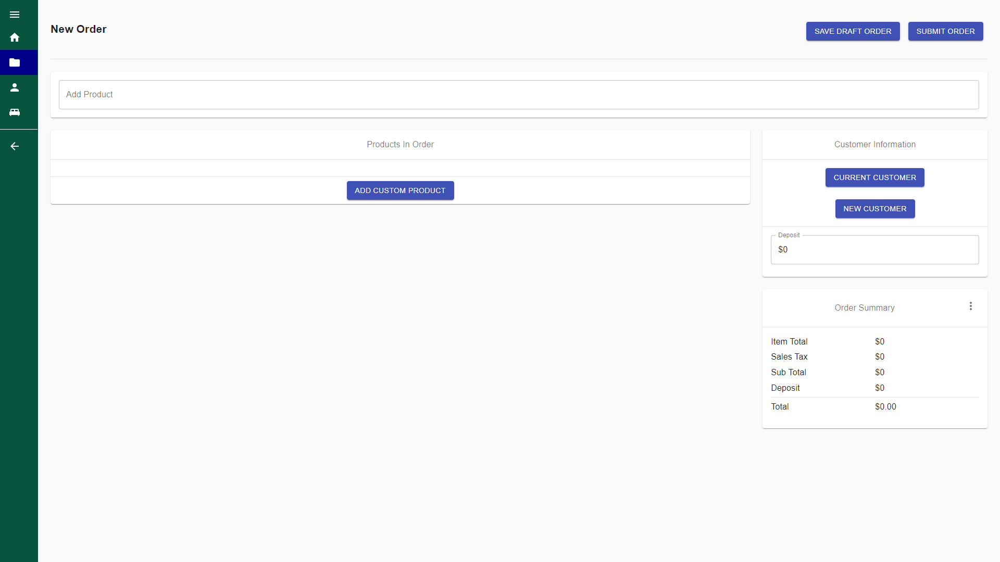

# Sales Manager App

This is a microservices app to allow my client to manage their Products, Customers, and Sales from a single GUI.

## Built With

- [Node.js](https://nodejs.org/en/) - Runtime
- [React](https://reactjs.org/) - Client
- [Material-UI](https://material-ui.com/) - React Base Component Library
- [Express](https://expressjs.com/) - Server / Framework
- [MongoDB](https://www.mongodb.com/) - Persistant Document Storage
- [JWT](https://jwt.io/) - Auth Token Generation
- [Puppeteer](https://github.com/puppeteer/puppeteer) & [HandlebarsJS](https://handlebarsjs.com/) - Invoice Generator
- [PM2](https://pm2.keymetrics.io/) - Manages the Deployed Services
